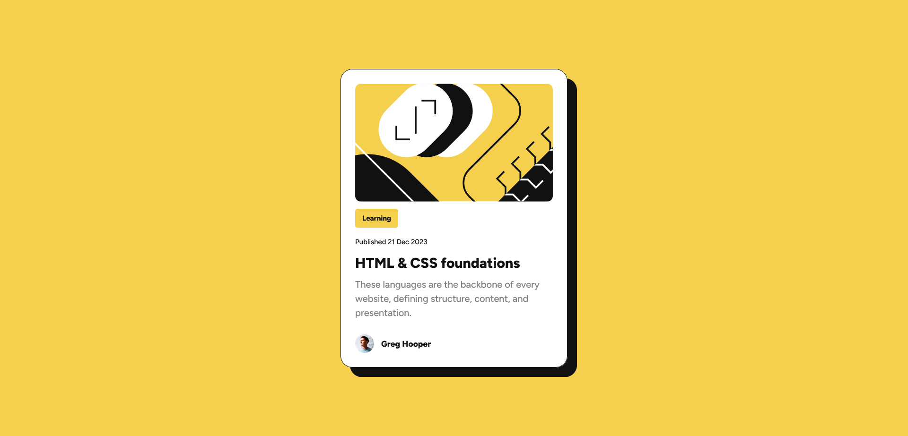

# Frontend Mentor - Blog preview card solution

This is a solution to the [Blog preview card challenge on Frontend Mentor](https://www.frontendmentor.io/challenges/blog-preview-card-ckPaj01IcS). Frontend Mentor challenges help you improve your coding skills by building realistic projects. 

## Table of contents

- [Overview](#overview)
  - [The challenge](#the-challenge)
  - [Screenshot](#screenshot)
  - [Links](#links)
- [My process](#my-process)
  - [Built with](#built-with)
  - [What I learned](#what-i-learned)
  - [Continued development](#continued-development)
  - [Useful resources](#useful-resources)
- [Author](#author)
- [Acknowledgments](#acknowledgments)

**Note: Delete this note and update the table of contents based on what sections you keep.**

## Overview

### The challenge

Users should be able to:

- See hover and focus states for all interactive elements on the page

### Screenshot

### Links

- Solution URL: [Add solution URL here](https://github.com/AutumnsCode/FEM-Learning-Path/tree/main/Start/blog-preview-card)
- Live Site URL: [Add live site URL here](https://hilarious-conkies-00df4f.netlify.app/)

## My process

### Built with

- Semantic HTML5 markup
- CSS custom properties
- Flexbox
- CSS Grid
- Mobile-first workflow
- Hover/focus
- CSS Layer

### What I learned

I was looking forward to use layer in native CSS as I thought it would be the perfect opportunity for it. Since it a rather small project, I used only for:

- reset
- body(with wrapper)
- root

### Continued development

How to work with CSS nesting and layer more

## Author

- Frontend Mentor - [@AutumnsCode](https://www.frontendmentor.io/profile/AutumnsCode)

